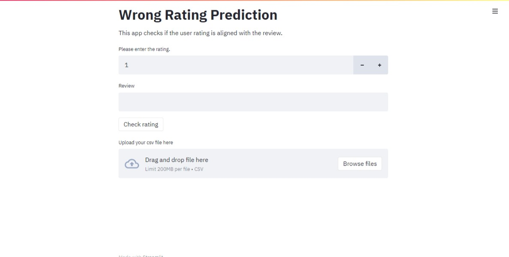

# Wrong Rating Prediction Application

## Description

This app checks whether the given rating is matching the given review. It is deployed using streamlit.
The sentiment analysis is done using the hugging face transformers module. 


To run the app on local machine

```
python -m venv wrpenv

wrpenv\Scripts\activate

pip install requirements.txt

streamlit run streamlit_app.py
```

